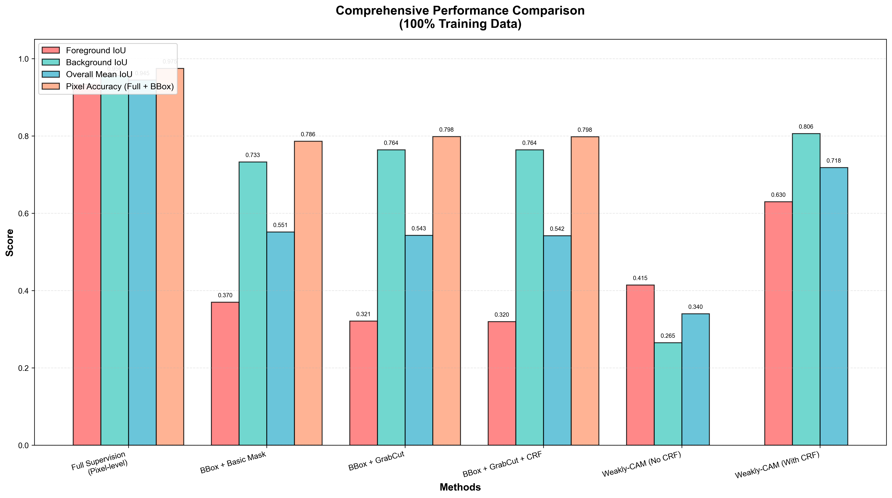
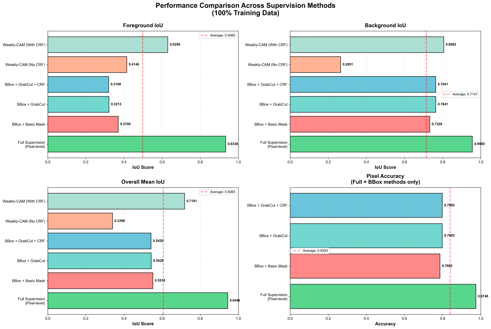
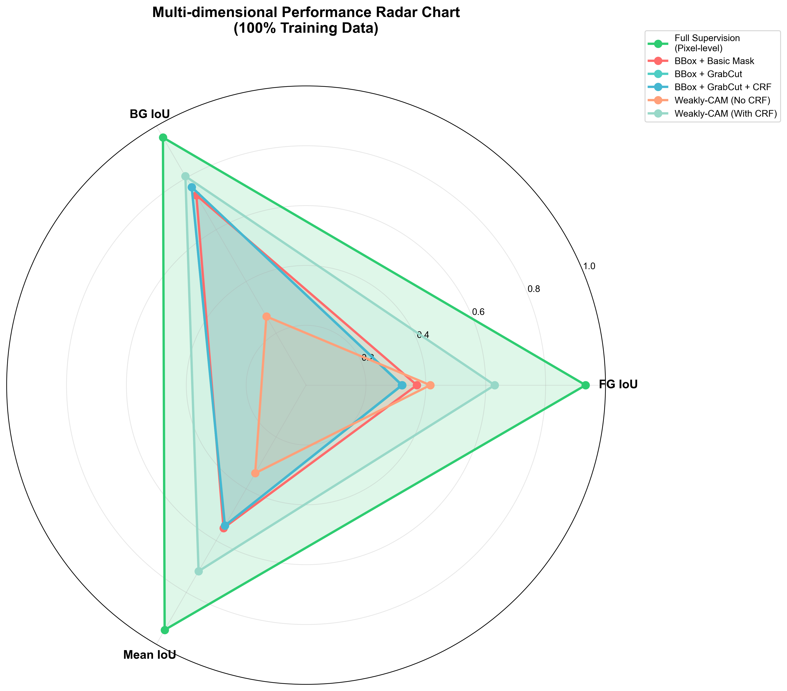
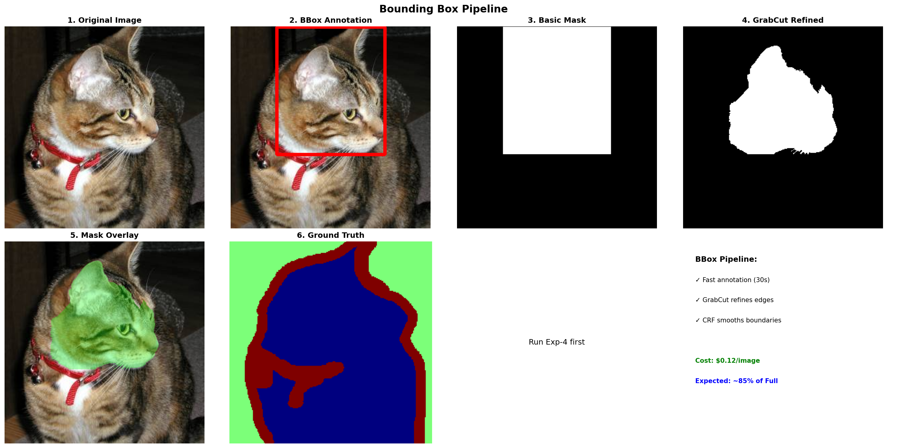
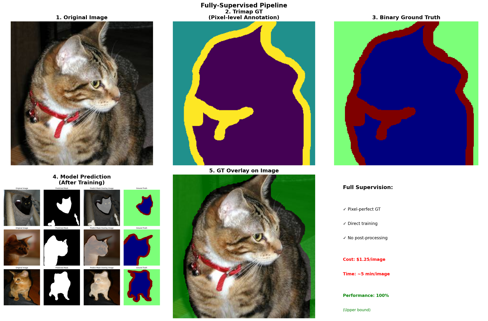
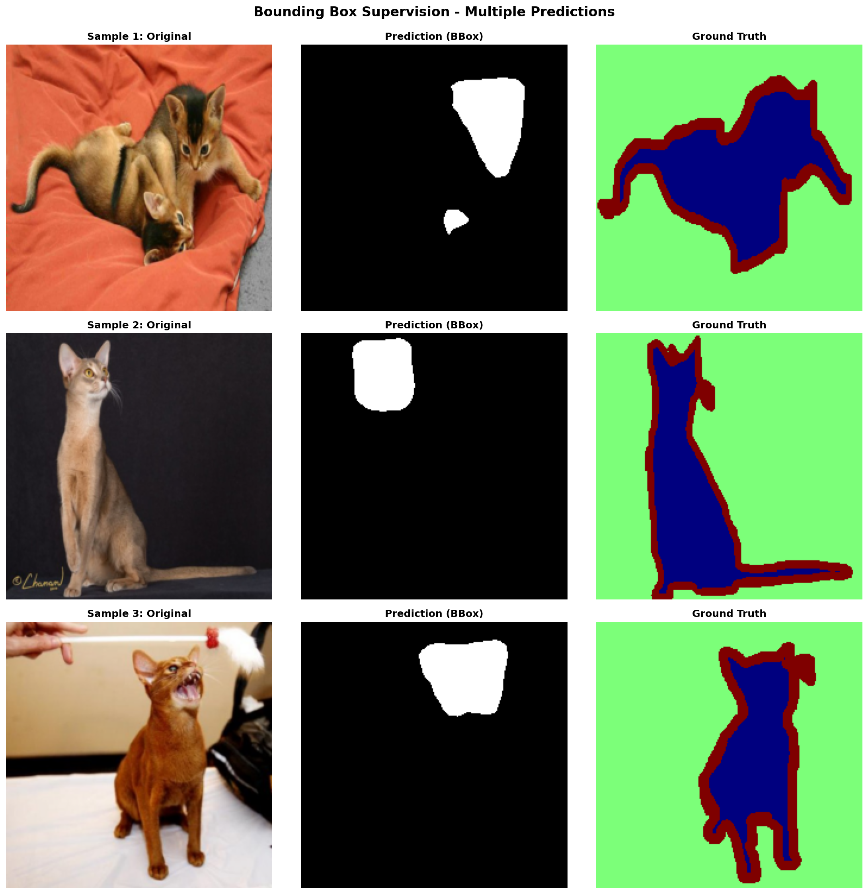
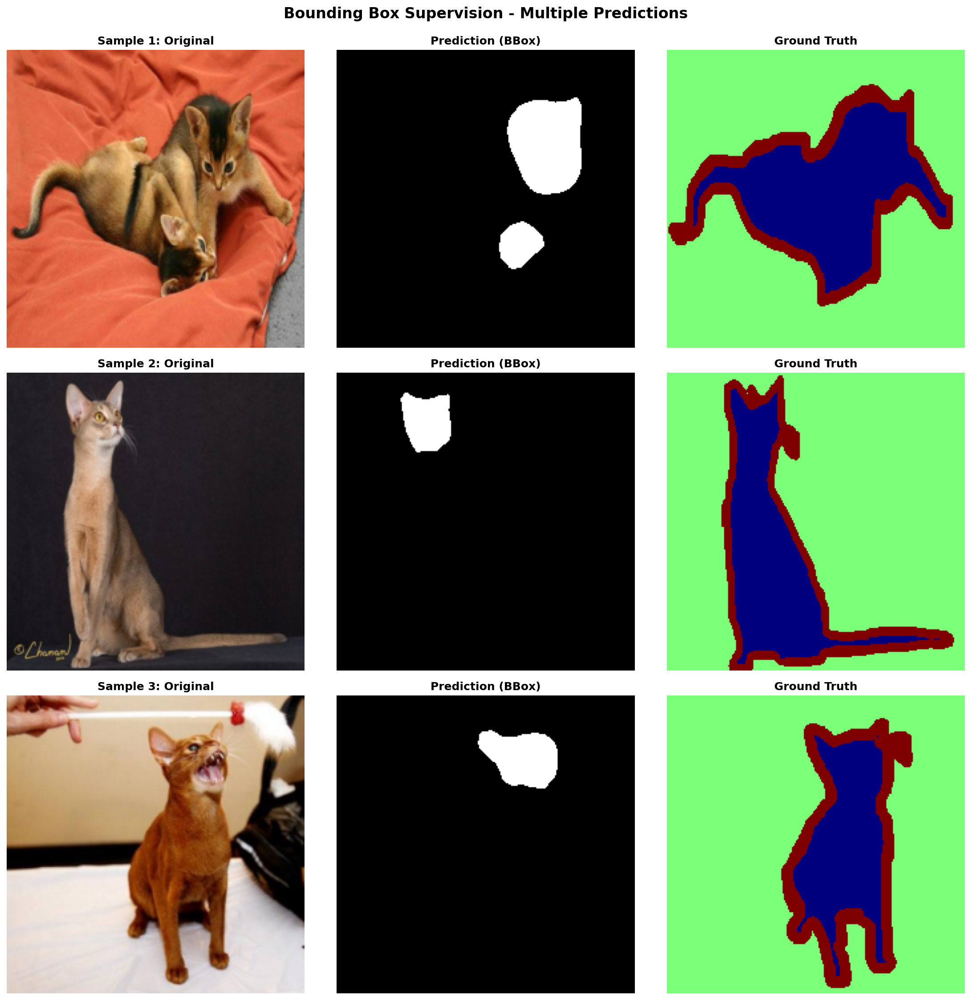
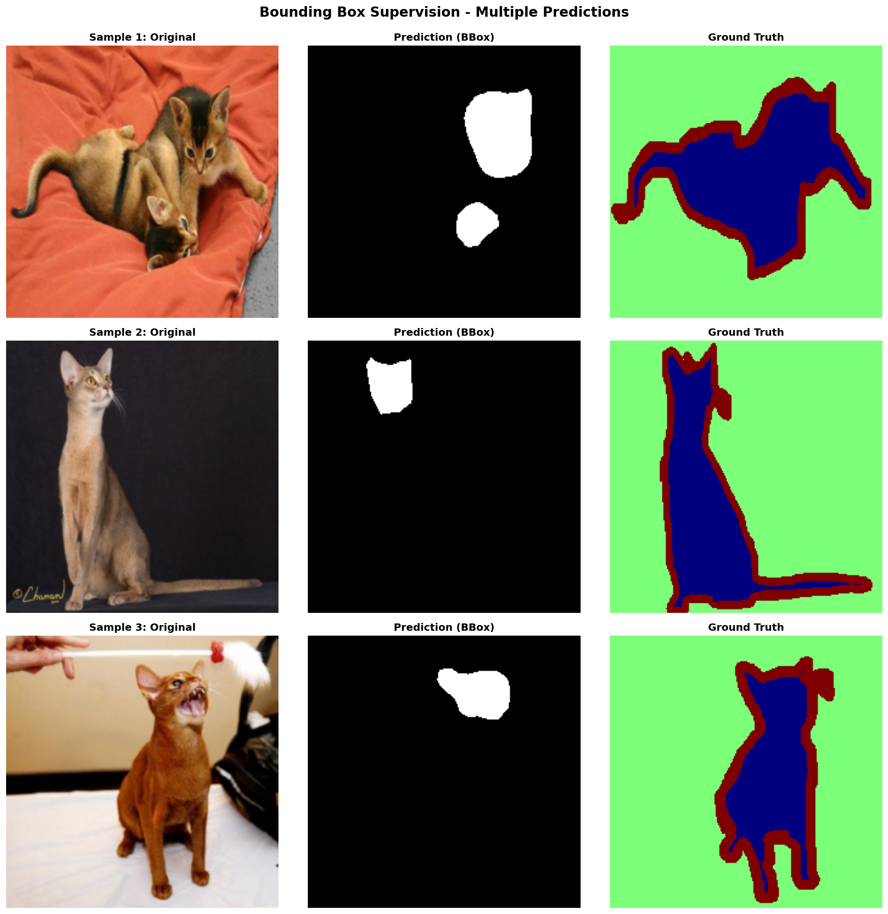

# Evaluating Annotation Granularity Trade-offs in Semantic Segmentation: A Comprehensive Study on Performance, Cost, and Efficiency

**Research Question**: How do different annotation granularities (pixel-level, bounding box, image-level) affect semantic segmentation performance, and what are the optimal trade-offs between annotation cost and model accuracy?

### 🎯 Research Value & Contributions

This study provides **quantitative evidence and practical insights** for annotation strategy selection in real-world semantic segmentation tasks:

1. **Systematic Performance-Cost Analysis**: First comprehensive comparison of three annotation granularities (pixel, bbox, image-level) under controlled experimental conditions with identical model architecture (DeepLabV3) and dataset (Oxford-IIIT Pet)

2. **Refinement Technique Evaluation**: Rigorous ablation studies quantifying the impact of post-processing methods (GrabCut, CRF) across different supervision levels, revealing that CRF provides +110% improvement for image-level methods but minimal effect (-0.15%) for bbox methods

3. **Actionable Cost-Benefit Recommendations**: Demonstrates that image-level supervision with CAM+CRF achieves **76% of full supervision performance at only 3.3% of annotation cost** (10s vs 300s per image), providing clear guidance for budget-constrained projects

4. **Reproducible Experimental Framework**: Open-source implementation with automated dataset management, standardized evaluation metrics (FG/BG IoU, Mean IoU, Pixel Accuracy), and comprehensive ablation studies enabling easy replication and extension

## 📊 Project Overview

This project compares three levels of annotation supervision for semantic segmentation:
- **Full Supervision** (Pixel-level trimaps) - 300 sec/img
- **BBox Supervision** (Bounding boxes + refinements) - 30 sec/img  
- **Image-level Supervision** (Class labels + CAM) - 10 sec/img

### Key Results (100% Training Data)

| Method | Mean IoU | Retention | Cost | Ranking |
|--------|----------|-----------|------|---------|
| Full Supervision | **0.9446** | 100% | 300s/img | 🥇 Baseline |
| Image-level CAM+CRF | **0.7181** | 76% | 10s/img | 🥈 **Best ROI** |
| BBox Basic | 0.5515 | 58.4% | 30s/img | 🥉 |
| BBox + GrabCut | 0.5428 | 57.5% | 30s/img | #4 |
| BBox + GrabCut + CRF | 0.5420 | 57.4% | 30s/img | #5 |
| Image-level CAM | 0.3398 | 36% | 10s/img | #6 |

**Key Finding**: Image-level supervision with CAM+CRF achieves 76% of full supervision performance at only 3.3% of the annotation cost!

## 📊 Visualizations

### Performance Comparison

All methods compared across different metrics (100% training data):



*Comprehensive performance comparison showing Foreground IoU, Background IoU, Overall Mean IoU, and Pixel Accuracy across all methods.*

### Detailed Analysis

#### 4-Panel Performance Breakdown


*Individual metric breakdowns: Foreground IoU, Background IoU, Overall Mean IoU, and Pixel Accuracy (Full + BBox methods).*

#### Multi-dimensional Radar Chart


*Multi-dimensional performance radar chart showing the relative strengths of each method across FG IoU, BG IoU, and Mean IoU.*

### Method-Specific Visualizations

#### BBox Pipeline


*BBox refinement pipeline showing: Original → BBox → Basic Mask → GrabCut → CRF refinement.*

#### Full Supervision Pipeline


*Full supervision training pipeline with pixel-level ground truth annotations.*

### Sample Predictions

#### Prediction Comparisons
<p float="left">
  
  
  
</p>

*Sample predictions from BBox methods: (Left) Basic masks, (Middle) GrabCut refined, (Right) GrabCut+CRF refined.*

## 🚀 Quick Start

### Prerequisites
- Python 3.8+
- PyTorch 1.10+
- CUDA-capable GPU (recommended)
- 10GB+ free disk space

### Installation

1. **Clone the repository**
```bash
git clone https://github.com/KarenShark/EE4211-Course-Project.git
cd EE4211-Course-Project
```

2. **Install dependencies**
```bash
pip install torch torchvision --index-url https://download.pytorch.org/whl/cu121
pip install opencv-python matplotlib pillow pandas
pip install git+https://github.com/lucasb-eyer/pydensecrf.git
```

3. **Run the main experiment notebook**
```bash
jupyter notebook annotation_granularity_comparison.ipynb
```

### 📥 Data Download

**No manual data download needed!** The notebook automatically downloads the Oxford-IIIT Pet dataset using torchvision.

When you run Cell 8 in the notebook:
- ✅ Downloads images (7390 total)
- ✅ Downloads trimap annotations (for full supervision)
- ✅ Downloads bounding box XMLs (for bbox supervision)
- ✅ Generates ground truth masks
- ✅ Organizes into proper folder structure

The data will be saved to `data/` folder (auto-created):
```
data/
├── images/                    # 7390 images
├── annotations/
│   ├── trimaps/              # Pixel-level masks (full supervision)
│   └── xmls/                 # Bounding box annotations
└── oxford-iiit-pet/          # Original torchvision download
```

### 📦 Pre-trained Weights

**Skip Training & Use Pre-trained Models!**

We provide pre-trained weights for all 6 methods trained on 100% of the dataset:

**🔗 Download All Weights** (Google Drive):  
📥 [**Download Pre-trained Weights (ZIP)**](https://drive.google.com/file/d/1a_6nnTpNVzewXwbBY85c3PYxujJTaBgb/view?usp=sharing)

**Included Models**:
- ✅ `deeplab_model.pth` - Full Supervision (0.9446 IoU)
- ✅ `box_trained_basic.pth` - BBox Basic (0.5515 IoU)
- ✅ `box_trained_grabcut.pth` - BBox + GrabCut (0.5428 IoU)
- ✅ `box_trained_grabcut_crf.pth` - BBox + GrabCut + CRF (0.5420 IoU)
- ✅ `deeplabv3_gradcam_no_crf.pth` - CAM without CRF (0.3398 IoU)
- ✅ `deeplabv3_gradcam_crf.pth` - CAM with CRF (0.7181 IoU) ⭐

**Usage**:
1. Download the ZIP file from Google Drive
2. Extract to `Trained Weights/` folder in project root
3. Run evaluation cells in the notebook directly (skip training cells)

```bash
# Create directory if not exists
mkdir -p "Trained Weights"

# Extract downloaded weights
unzip trained_weights.zip -d "Trained Weights/"
```

**Benefits**:
- ⏱️ **Save Time**: Skip 2-3 hours of training
- 💰 **Save Resources**: No GPU required for evaluation only
- 🎯 **Reproduce Results**: Use exact weights from our experiments
- 🚀 **Quick Demo**: Test and visualize immediately

## 📁 Project Structure

```
EE4211-Course-Project/
├── annotation_granularity_comparison.ipynb  # Main experiment notebook
├── compare_methods_visualization.py         # Generate comparison charts
│
├── fully-supervised/          # Full supervision (pixel-level)
│   ├── main.py               # Training script
│   ├── models/               # DeepLabV3+ (ResNet50 backbone)
│   └── ...
│
├── bbox-supervision/          # Bounding box supervision
│   ├── main.py               # Training with GrabCut/CRF refinements
│   ├── bounding_box.py       # BBox processing
│   ├── crf.py                # Dense CRF refinement
│   └── ...
│
├── image-level-supervision/   # Image-level (CAM-based)
│   ├── main.py               # CAM training pipeline
│   ├── vgg_train.py          # VGG16 classifier
│   ├── grad_cam.py           # Grad-CAM generation
│   └── ...
│
├── scripts/                   # Utility scripts
├── utils/                     # Helper functions
├── Visualizations/            # Generated comparison charts
└── Trained Weights/           # Pre-trained model weights
```

## 🔬 Running Experiments

### Option 1: Run All Experiments (Main Notebook)

Open `annotation_granularity_comparison.ipynb` and run all cells:
- Automatically downloads dataset
- Runs all 6 experiments
- Generates comparison visualizations
- Saves results to JSON files

**Data Percentage Options**:
- `DATA_PERCENTAGE = 0.1` - Quick test (~15 min total)
- `DATA_PERCENTAGE = 1.0` - Full training (~2-3 hours total)

### Option 2: Run Individual Methods

**Full Supervision**:
```bash
python fully-supervised/main.py --model_name deeplab --data_percentage 1.0
```

**BBox Supervision**:
```bash
# Basic mask
python bbox-supervision/main.py --data_percentage 1.0 --use_grabcut False --use_crf False

# With GrabCut refinement
python bbox-supervision/main.py --data_percentage 1.0 --use_grabcut True --use_crf False

# Full pipeline (GrabCut + CRF)
python bbox-supervision/main.py --data_percentage 1.0 --use_grabcut True --use_crf True
```

**Image-level Supervision**:
```bash
# CAM without CRF
python image-level-supervision/main.py --data_percentage 1.0 --use_crf False

# CAM with CRF (best weakly-supervised method)
python image-level-supervision/main.py --data_percentage 1.0 --use_crf True
```

## 📈 Generate Your Own Visualizations

After running experiments, you can generate comparison charts:

```bash
python compare_methods_visualization.py
```

This creates 4 comparison charts in `Visualizations/`:
- `methods_comparison_detailed.png` - 4-panel detailed comparison
- `methods_comparison_combined.png` - All metrics in one chart
- `methods_comparison_radar.png` - Multi-dimensional radar chart
- `methods_comparison_table.png` - Performance ranking table

## 🎯 Key Findings

### Performance Retention vs Cost

| Supervision Level | Cost (sec/img) | Cost (%) | Mean IoU | Retention (%) |
|-------------------|----------------|----------|----------|---------------|
| Pixel-level | 300 | 100% | 0.9446 | 100% |
| BBox | 30 | 10% | 0.55 | 58% |
| Image-level | 10 | 3.3% | **0.72** | **76%** ⭐ |

### Unexpected Discoveries

1. **CAM+CRF outperforms BBox methods**: Despite using weaker supervision (only class labels), image-level CAM with CRF refinement achieves significantly better performance than bounding box methods.

2. **GrabCut/CRF don't help BBox**: Traditional refinement techniques (GrabCut, CRF) provide minimal or negative improvement for BBox-based pseudo-labels on this dataset.

3. **CRF is critical for CAM**: CRF refinement provides +111% improvement for CAM-based methods (0.34 → 0.72 IoU), effectively filling incomplete activations.

### Recommendations

- **Critical applications** (medical, autonomous driving): Use full supervision
- **Standard applications** with limited budget: Use **image-level CAM+CRF** (best ROI)
- **When pixel-accurate boundaries needed**: Consider full supervision despite higher cost

## 📈 Results Files

After running experiments, results are saved to:
- `fully-supervised/output/results_deeplab.json`
- `bbox-supervision/results_bbox_*.json`
- `image-level-supervision/results_*.json`

Each JSON contains:
- Mean IoU (overall)
- Foreground IoU
- Background IoU
- Pixel Accuracy (where applicable)

## 🔧 Troubleshooting

### Data Download Issues
If automatic download fails:
1. Check internet connection
2. Manually download from: https://www.robots.ox.ac.uk/~vgg/data/pets/
3. Extract to `data/` folder

### CUDA Out of Memory
- Reduce batch size in respective `main.py` files
- Use `DATA_PERCENTAGE = 0.1` for testing

### Missing Dependencies
```bash
pip install -r requirements.txt  # If requirements.txt exists
```

## 📝 Citation

Dataset: Oxford-IIIT Pet Dataset
```
@InProceedings{parkhi12a,
  author       = "Parkhi, O. M. and Vedaldi, A. and Zisserman, A. and Jawahar, C.~V.",
  title        = "Cats and Dogs",
  booktitle    = "IEEE Conference on Computer Vision and Pattern Recognition",
  year         = "2012",
}
```

## 📧 Contact

For questions or issues, please open an issue on GitHub.

## 📄 License

This project is for academic use only.

